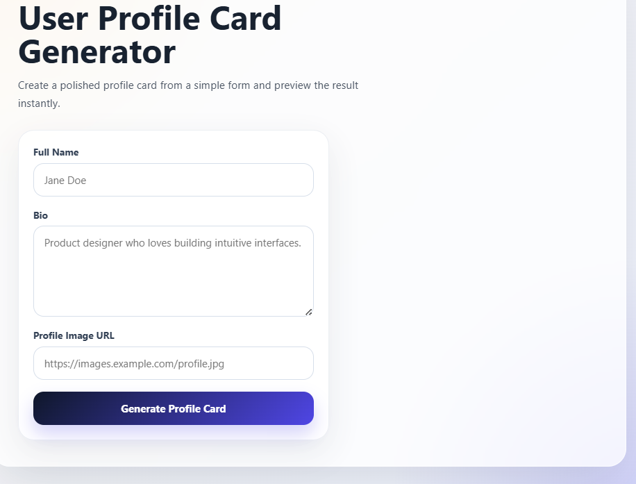

# User Profile Card Generator

# User Profile Card Generator


A full-stack web application built with **React (Vite)** and **Flask** that allows users to generate a profile card by entering their name, bio, and profile image URL. The application demonstrates frontend-backend communication using HTTP POST requests and JSON data.

---

## Project Overview

This project showcases how a React frontend communicates with a Flask backend through a REST API.

Users can:

- Enter their full name
- Write a short bio
- Provide a profile image URL

The frontend sends the data to the Flask backend using a **POST** request. The backend validates the input and returns a JSON response, which is then displayed as a formatted profile card on the frontend.

---

## Features

- React frontend built with Vite
- Flask backend with REST API
- Form validation
- HTTP POST request handling
- JSON request and response
- Dynamic profile card generation
- Responsive user interface
- Error handling for invalid requests
- Success message after profile generation

---

## Tech Stack

### Frontend

- React
- Vite
- JavaScript
- CSS

### Backend

- Python
- Flask
- Flask-CORS

---

## Project Structure

```
user-profile-card-generator/
│
├── backend/
│   ├── app.py
│   └── requirements.txt
│
├── frontend/
│   ├── src/
│   │   ├── App.jsx
│   │   ├── main.jsx
│   │   └── styles.css
│   │
│   ├── index.html
│   ├── package.json
│   ├── package-lock.json
│   └── vite.config.js
│
├── assets/
│   ├── input-form.png
│   └── generated-profile-card.png
│
├── .gitignore
└── README.md
```

---

## API Endpoint

### POST `/profile`

**Request Body**

```json
{
  "name": "Daniel Carter",
  "bio": "Data Scientist with expertise in Python and Machine Learning.",
  "image": "https://randomuser.me/api/portraits/men/75.jpg"
}
```

**Response**

```json
{
  "name": "Daniel Carter",
  "bio": "Data Scientist with expertise in Python and Machine Learning.",
  "image": "https://randomuser.me/api/portraits/men/75.jpg"
}
```

---

## Screenshots

### User Input Form



### Generated Profile Card


---

## Installation & Setup

### 1. Clone the Repository

```bash
git clone https://github.com/Dbarsha-hub/User-Profile-Card-Generator.git
cd user-profile-card-generator
```

---

### 2. Backend Setup

```bash
cd backend

pip install -r requirements.txt

python app.py
```

Backend runs at:

```
http://127.0.0.1:5000
```

---

### 3. Frontend Setup

Open another terminal:

```bash
cd frontend

npm install

npm run dev
```

Frontend runs at:

```
http://localhost:5173
```

---

## Usage

1. Start the Flask backend.
2. Start the React frontend.
3. Open the application in your browser.
4. Enter:
   - Full Name
   - Bio
   - Profile Image URL
5. Click **Generate Profile Card**.
6. View the generated profile card instantly.

---

## Learning Outcomes

- Building REST APIs using Flask
- Connecting React with Flask
- Handling HTTP POST requests
- Working with JSON data
- Client-side form validation
- Managing state with React Hooks
- Error handling and user feedback
- Creating responsive user interfaces

---

## Future Enhancements

- Upload profile images instead of using URLs
- Edit existing profile cards
- Save profiles using a database
- Add dark mode
- Authentication and user accounts

---

## Author

**Barsha Priyadarshini Das**
